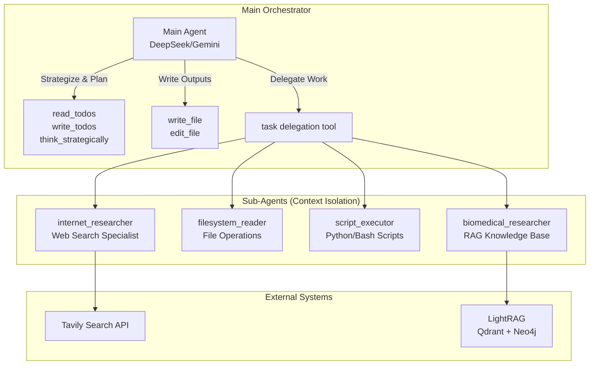
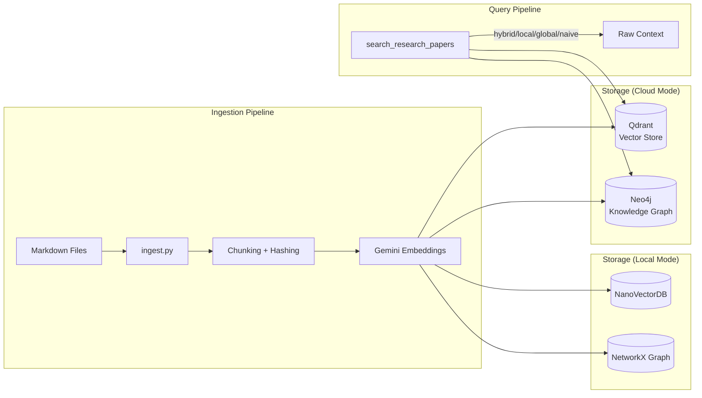
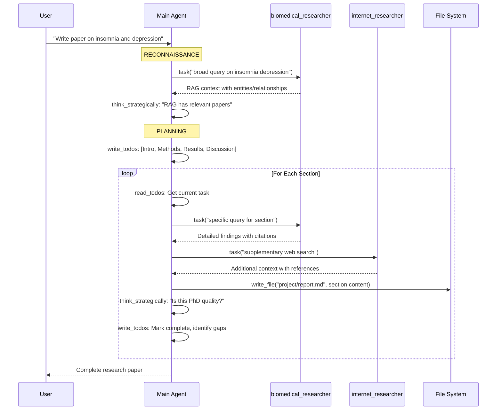

# Deep Research Agent (Daedalus) - Complete Project Documentation

## Executive Summary

This document provides a comprehensive technical documentation of the **Daedalus** project—a biomedical research agent designed to address **context drift** in long-horizon AI tasks. The system implements a deep agent architecture using LangGraph that employs four key context engineering techniques: **Write**, **Select**, **Compress**, and **Isolate**.

---

## 1. Problem Statement & Thesis Context

### The Core Problem: Context Drift

Current AI agents (ReAct, multi-agent teams) suffer from **context drift**—they forget important details, lose focus, and hallucinate as tasks get longer. This is particularly problematic in biomedical research tasks that require:

- Processing dozens of research papers
- Maintaining citation coherence across long documents
- Synthesizing findings from multiple sources
- Writing comprehensive reports section-by-section

### Your Solution

A deep agent using LangGraph that:

1. **Writes** reports section-by-section with reflection loops
2. **Selects** information via RAG sub-agent or direct file reading
3. **Compresses** context at 80% capacity to prevent overflow
4. **Isolates** heavy tasks to sub-agents to keep main context clean

---

## 2. Project Structure Overview

```
react-agent/
├── src/
│   ├── agent_graph/           # Core agent implementation
│   │   ├── graph.py           # Main graph builder (create_react_agent)
│   │   ├── state.py           # State definitions (DeepAgentState, Todo)
│   │   ├── tools.py           # 23+ tools including task delegation
│   │   ├── prompts.py         # 650+ lines of system prompts
│   │   ├── context.py         # Runtime configuration (models, params)
│   │   ├── lightrag_agent.py  # Standalone LightRAG agent
│   │   └── utils.py           # Model loading utilities
│   │
│   └── rag/                   # LightRAG integration
│       ├── config.py          # Storage config (Cloud: Qdrant+Neo4j / Local)
│       ├── ingest.py          # Document ingestion with deduplication
│       ├── query.py           # Query modes (hybrid/local/global/naive)
│       └── rag_search_tool.py # LangChain tool wrapper
│
├── agent_skills/              # Progressive disclosure metacognitive frameworks
│   ├── gap_analysis.md        # Gap identification framework
│   ├── insight_generation.md  # Hypothesis synthesis framework
│   ├── research_progression.md# Session continuity framework
│   └── metadata.py            # Skill metadata for prompts
│
├── agent_workspace/           # Sandboxed output directory
├── langgraph.json             # LangGraph Studio configuration
└── pyproject.toml             # Dependencies
```

---

## 3. Architecture Deep Dive

### 3.1 Hierarchical ReAct Agent Pattern

The system implements a **hierarchical ReAct (Reasoning and Action) agent** architecture:



### 3.2 State Management (DeepAgentState)

The agent uses a custom state class that extends LangGraph's `AgentState`:

```python
class Todo(TypedDict):
    """Task tracking with status."""
    content: str
    status: Literal["pending", "in_progress", "completed"]

class DeepAgentState(AgentState):
    """Extended state with scratchpad."""
    # Inherited: messages, remaining_steps
    todos: NotRequired[list[Todo]]  # Task tracking
```

**Key State Features:**

- **Messages**: Conversation history with `add_messages` annotation for append-only semantics
- **Todos**: External memory/scratchpad for tracking multi-step workflows
- **Remaining Steps**: Managed field for recursion control (limit: 50,000 steps)

### 3.3 Context Engineering Techniques

#### Technique 1: WRITE (Scratchpad-Driven Execution)

The agent maintains an external todo list as persistent memory:

```
The Loop:
1. read_todos → Identify next task
2. EXECUTE → Do the task (research, write, etc.)
3. think_strategically → Reflect on what you learned
4. write_todos → Update plan
5. LOOP → Return to step 1
```

**Implementation:**

- `read_todos` tool: Injects current state into tool message
- `write_todos` tool: Returns `Command` to update state with new todos
- Bayesian plan evolution: Plans adapt based on findings (confirm, evolve, prune, deepen)

#### Technique 2: SELECT (Information Retrieval)

Multi-modal information selection:

| Source                  | Tool                       | When to Use                         |
| ----------------------- | -------------------------- | ----------------------------------- |
| LightRAG Knowledge Base | `search_research_papers`   | Biomedical papers, structured data  |
| Web Search              | `web_search` (Tavily)      | Current info, non-biomedical topics |
| File System             | `read_file`, `file_search` | Existing reports, raw markdown      |

**LightRAG Query Modes:**

- `hybrid` (default): Combined entity + relationship search
- `local`: Specific facts (OR, CI, p-values, sample sizes)
- `global`: Broad themes across papers
- `naive`: Simple vector similarity

#### Technique 3: COMPRESS (Context Management)

Context compression is achieved through:

1. **Iterative Writing**: Write section-by-section, not entire documents
2. **Think Strategically**: Pause after each major step to reflect and prune irrelevant context
3. **Selective Retrieval**: Sub-agents return only relevant findings, not full search results

#### Technique 4: ISOLATE (Sub-Agent Context Isolation)

Heavy context tasks are delegated to sub-agents with **fresh context**:

```python
# From tools.py - task delegation
state["messages"] = [{"role": "user", "content": description}]
# Sub-agent receives ONLY the task description
# No parent conversation history → no context pollution
```

**Sub-Agent Configurations:**

| Name                    | Purpose                   | Tools                                                               |
| ----------------------- | ------------------------- | ------------------------------------------------------------------- |
| `internet_researcher`   | Web research specialist   | `web_search`, `think_strategically`                                 |
| `filesystem_reader`     | Read-only file operations | `list_directory`, `read_file`, `file_search`, `file_content_search` |
| `script_executor`       | Python/Bash execution     | `execute_bash`, `write_file`, `list_directory`                      |
| `biomedical_researcher` | RAG knowledge base        | `search_research_papers`                                            |

---

## 4. Tools Implementation

### 4.1 Core Tool Categories

#### Orchestration Tools (Main Agent)

```python
read_todos(state, tool_call_id) → str     # Read current todo list
write_todos(todos, tool_call_id) → Command # Update state with todos
think_strategically(reflection) → str      # Record strategic reflection
load_skill(skill_name) → str               # Load metacognitive framework
```

#### File Operation Tools

```python
list_directory(path) → str         # ls equivalent
read_file(path) → str              # Full file content
write_file(path, content) → str    # Create/overwrite (agent_workspace only)
edit_file(path, old_text, new_text) → str  # Partial replacement
file_search(pattern, path) → str   # Glob pattern matching
file_content_search(pattern, file_pattern, path) → str  # Grep equivalent
```

#### Research Tools

```python
web_search(query) → str                    # Tavily AI search
search_research_papers(query, mode) → str  # LightRAG knowledge base
```

#### Execution Tools

```python
execute_bash(command, tool_call_id) → str  # Sandboxed bash (agent_workspace)
```

### 4.2 Task Delegation Tool

The `task` tool is **the core mechanism for context isolation**:

```python
def _create_task_tool(tools, subagents, model, state_schema, researcher_model=None):
    """Create task delegation tool with sub-agent registry."""

    @tool
    async def task(description: str, subagent_type: str, state, tool_call_id):
        # Get sub-agent
        sub_agent = agents[subagent_type]

        # CONTEXT ISOLATION: Fresh context with only task description
        state["messages"] = [{"role": "user", "content": description}]

        # Execute sub-agent
        result = await sub_agent.ainvoke(state, config={"recursion_limit": 100})

        # Return results via ToolMessage
        return Command(update={"messages": [ToolMessage(content, tool_call_id)]})

    return task
```

### 4.3 Security & Path Validation

All file operations are sandboxed:

```python
# Allowed directories
Read: agent_workspace/, src/rag/research_paper_results_reports/,
      src/rag/files_to_embed/, src/scripts_for_agent/
Write: agent_workspace/ (ONLY)

# All paths validated and resolved before use
# Commands executed in agent_workspace/ with venv activation
```

---

## 5. LightRAG Integration

### 5.1 Architecture

LightRAG provides **graph-based retrieval** over biomedical research papers:



### 5.2 Storage Configuration

```python
# config.py
STORAGE_MODE = "cloud"  # or "local"

# Cloud: Production-grade
- Vector Store: Qdrant (cloud.qdrant.io)
- Graph Store: Neo4j (neo4j+s://...)

# Local: Development
- Vector Store: NanoVectorDB (file-based)
- Graph Store: NetworkX (in-memory)
```

### 5.3 Query Modes

| Mode     | Description                           | Use Case                     |
| -------- | ------------------------------------- | ---------------------------- |
| `hybrid` | Combined entity + relationship search | Default for most queries     |
| `local`  | Entity-focused with specific facts    | Statistics, OR, CI, p-values |
| `global` | Relationship patterns across papers   | Broad themes, summaries      |
| `naive`  | Simple vector similarity              | Keyword matching             |

### 5.4 Search Tool Implementation

```python
@tool
async def search_research_papers(query: str, mode: str = "hybrid") -> str:
    """Search biomedical knowledge base."""
    rag = await get_cached_rag()

    context = await rag.aquery(
        query,
        param=QueryParam(
            mode=mode,
            top_k=30,           # KG Top K
            chunk_top_k=8,      # Chunk Top K
            only_need_context=True,  # Return raw context, not LLM answer
            enable_rerank=False
        )
    )
    return context
```

---

## 6. System Prompts Architecture

### 6.1 Prompt Structure (658 lines)

The system prompt is structured into these sections:

1. **Core Workflow: Scratchpad-Driven Execution** - The read/execute/reflect/update loop
2. **Task Complexity Assessment** - Simple/Moderate/Complex task handling
3. **Capabilities** - Tool descriptions and when to use them
4. **Data Access Priority** - RAG first, then internet, then files
5. **File Operations** - Directory structure and path conventions
6. **Iterative Writing Process** - Section-by-section with reflection
7. **PhD-Level Quality Standards** - Citation format, quantitative rigor
8. **Citation Management Workflow** - Coherent numbering, single References section
9. **Critical Guidelines** - Sequential execution, no summarization

### 6.2 Sub-Agent Prompts

Each sub-agent has specialized prompts:

| Sub-Agent                      | Prompt Focus                                                         |
| ------------------------------ | -------------------------------------------------------------------- |
| `INTERNET_RESEARCHER_PROMPT`   | Multi-angle research, numbered references, never say "nothing found" |
| `BIOMEDICAL_RESEARCHER_PROMPT` | LightRAG modes, statistical rigor, chunk source traceability         |
| `FILESYSTEM_READER_PROMPT`     | Read-only, full content return, no summarization                     |
| `SCRIPT_EXECUTOR_PROMPT`       | Plotting best practices, PDF conversion, error handling              |

### 6.3 Quality Standards Embedded in Prompts

**Citation Requirements:**

```
UNACCEPTABLE: "[1] Remote work trends ... forbes.com"
REQUIRED: "[1] Smith J. Remote work productivity trends in 2024: A comprehensive analysis. Forbes. 2024. https://www.forbes.com/..."
```

**Quantitative Rigor:**

```
UNACCEPTABLE: "significant association", "strong correlation"
REQUIRED: "rg=0.85 (SE=0.03, P=2.1×10^-8) [1]", "OR=1.34 (95% CI: 1.21-1.48) [2]"
```

---

## 7. Agent Skills (Progressive Disclosure)

### 7.1 Pattern Overview

Skills provide **metacognitive frameworks** loaded on-demand to avoid prompt bloat:

```python
# Loaded only when needed via load_skill("gap_analysis")
SKILLS_METADATA = {
    "gap_analysis": {
        "description": "Framework for identifying gaps, contradictions, unexplored areas",
        "when_to_use": "After gathering research, before finalizing sections"
    },
    "insight_generation": {...},
    "research_progression": {...}
}
```

### 7.2 Available Skills

| Skill                    | Purpose                                                      | When to Use                                 |
| ------------------------ | ------------------------------------------------------------ | ------------------------------------------- |
| **Gap Analysis**         | Identify missing research, contradictions, unexplored angles | After gathering context, before writing     |
| **Insight Generation**   | Synthesize connections, generate hypotheses                  | Discussion sections, formulating next steps |
| **Research Progression** | Track investigation across sessions                          | Session start/end, avoiding redundancy      |

### 7.3 Gap Analysis Framework

A domain-agnostic framework with 5 dimensions:

1. **Completeness**: What evidence types are missing?
2. **Perspective**: What alternative explanations haven't been considered?
3. **Consistency**: Where do sources disagree?
4. **Depth**: What mechanisms remain unclear?
5. **Utility**: What's impractical/untested?

---

## 8. Data Visualization Integration

The agent can create publication-quality plots:

```python
# Main agent delegates to script_executor:
task(script_executor, "Create bar chart of AI salaries: Munich EUR75k, Berlin EUR68k... Save to imgs/salary_comparison.png")

# script_executor uses matplotlib with best practices:
# - Figure size: (10, 6) or (12, 8)
# - DPI: 300 for publication quality
# - Axis label rotation for readability
# - Professional color palettes
```

**Directory Structure:**

```
agent_workspace/
├── project_name/
│   ├── report.md       # Uses: 
│   └── imgs/
│       ├── salary_comparison.png
│       └── trend_analysis.png
```

---

## 9. Runtime Configuration

### 9.1 Model Configuration

```python
@dataclass
class Context:
    model: str = "deepseek/deepseek-chat"      # Main orchestrator
    subagent_model: str = "google_genai/gemini-2.5-flash"  # Sub-agents
    max_search_results: int = 10
```

**Model Capabilities:**

- Main Agent: 16,384 max tokens, temperature 0.3
- Parallel tool calls disabled for state integrity
- Recursion limit: 50,000 steps

### 9.2 LangGraph Studio Integration

```json
{
  "graphs": {
    "agent": "./src/agent_graph/graph.py:graph",
    "lightrag_agent": "./src/agent_graph/lightrag_agent.py:graph"
  },
  "env": ".env",
  "python_version": "3.12"
}
```

---

## 10. Execution Flow Example

### Research Paper Generation Workflow



---

## 11. Key Design Decisions

### Why Hierarchical Architecture?

| Design                               | Benefit                                            |
| ------------------------------------ | -------------------------------------------------- |
| **Sub-agents with isolated context** | Prevents context pollution from long conversations |
| **Main agent writes directly**       | Maintains control over final output quality        |
| **Todo-based tracking**              | External memory survives context resets            |
| **Sequential tool execution**        | Ensures state consistency                          |

### Why LightRAG?

| Capability                  | Benefit                                             |
| --------------------------- | --------------------------------------------------- |
| **Knowledge Graph**         | Captures entity relationships across papers         |
| **Multiple query modes**    | Flexible retrieval (broad themes vs specific facts) |
| **Source traceability**     | Chunk IDs enable citation tracking                  |
| **Cloud/Local flexibility** | Production-ready with development fallback          |

### Why This Prompt Structure?

| Element                   | Purpose                                      |
| ------------------------- | -------------------------------------------- |
| **Scratchpad loop**       | Forces systematic progress tracking          |
| **Complexity assessment** | Prevents over-engineering simple tasks       |
| **PhD-level standards**   | Embeds quality requirements in system prompt |
| **Citation workflow**     | Coherent referencing across long documents   |

---

## 12. Thesis Contribution Summary

This project demonstrates that **context engineering techniques** (write, select, compress, isolate) improve accuracy and coherence in long-horizon biomedical research tasks compared to standard RAG and basic agents.

### Implemented Techniques

1. **Write**: Scratchpad-driven execution with todo tracking
2. **Select**: Multi-modal retrieval (LightRAG + Tavily + files)
3. **Compress**: Iterative writing with strategic reflection
4. **Isolate**: Sub-agent delegation with fresh context

### Technical Innovations

- **Task delegation tool** with context isolation via `Command` state updates
- **LightRAG integration** with four query modes for biomedical knowledge
- **Agent skills** with progressive disclosure pattern
- **PhD-level prompting** with citation coherence enforcement

---

## 13. File Reference Summary

| File                                                                                                            | Lines | Purpose                                      |
| --------------------------------------------------------------------------------------------------------------- | ----- | -------------------------------------------- |
| [graph.py](file:///home/aditya-ladawa/Aditya/RESEARCH_PROJECT/react-agent/src/agent_graph/graph.py)             | 105   | Main graph builder with `create_react_agent` |
| [state.py](file:///home/aditya-ladawa/Aditya/RESEARCH_PROJECT/react-agent/src/agent_graph/state.py)             | 68    | State definitions (DeepAgentState, Todo)     |
| [tools.py](file:///home/aditya-ladawa/Aditya/RESEARCH_PROJECT/react-agent/src/agent_graph/tools.py)             | 840   | 23+ tools including task delegation          |
| [prompts.py](file:///home/aditya-ladawa/Aditya/RESEARCH_PROJECT/react-agent/src/agent_graph/prompts.py)         | 658   | System prompts for all agents                |
| [context.py](file:///home/aditya-ladawa/Aditya/RESEARCH_PROJECT/react-agent/src/agent_graph/context.py)         | 45    | Runtime configuration                        |
| [config.py](file:///home/aditya-ladawa/Aditya/RESEARCH_PROJECT/react-agent/src/rag/config.py)                   | 262   | LightRAG storage configuration               |
| [query.py](file:///home/aditya-ladawa/Aditya/RESEARCH_PROJECT/react-agent/src/rag/query.py)                     | 495   | Query functions with citation support        |
| [rag_search_tool.py](file:///home/aditya-ladawa/Aditya/RESEARCH_PROJECT/react-agent/src/rag/rag_search_tool.py) | 106   | LangChain tool wrapper                       |
| [gap_analysis.md](file:///home/aditya-ladawa/Aditya/RESEARCH_PROJECT/react-agent/agent_skills/gap_analysis.md)  | 315   | Metacognitive gap analysis framework         |

---

_This documentation covers the complete implementation as of January 2026._
